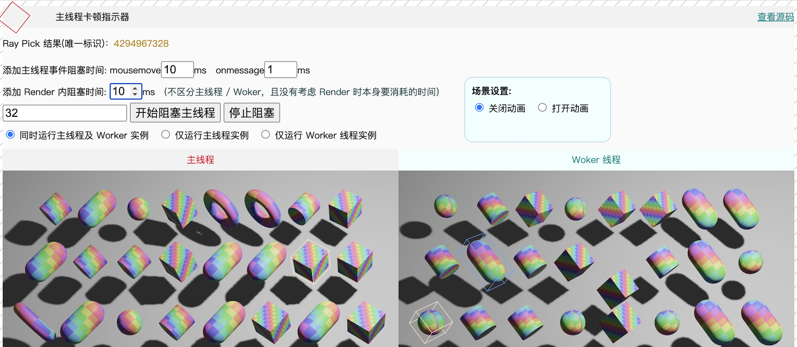

# Bevy in Web Worker
Demonstrates how to run the Bevy engine in a Web Worker and the interaction between HTML elements and Bevy.

Implemented `CanvasViewPlugin` to replace `bevy_winit`, allowing the Bevy engine to run efficiently in a Web Worker separate from the main thread, significantly improving application performance and responsiveness. It also demonstrates two-way communication between HTML elements and the Bevy engine, implementing complex interaction patterns to verify communication latency and performance between the Engine in the Web Worker and the main thread.

**Verification points:**

1. Whether the communication cost between the main thread and Worker is high.
2. Whether the asynchronous pick interface will lead to poor user interaction experience.
3. The impact of main thread blocking on events/worker.
4. The impact of blocking mouse events, onmessage, and render on the user experience.

**Design for the above verification points:**

1. No **Throttle** is applied to mouse event trigger frequency, every mousemove event is sent to the worker, which performs a ray pick and sends the result back to the main thread;
2. Designed a highly complex **selection/highlight** logic:
    1. Main thread postMsg to worker -> 
    2. Worker passes task to engine to execute ray pick -> 
    3. Results are sent from engine to worker -> 
    4. Worker postMsg to main thread -> 
    5. Main thread then postMsg to worker to execute required **selection/highlight**
3. Simulated main thread blocking scenarios, can control single frame blocking duration, with a **main thread stutter indicator** in the top left corner for easy observation of blocking results;
4. Interface provides both main thread and Worker thread running instances for easy visual comparison;
5. Simulated blocking scenarios in mousemove, onmessage, and render;
6. Provided functionality to drag scene objects by holding the left mouse button;
7. Simulated frame rendering logic for tool-like apps: after turning off scene animation, frame rendering is entirely driven by mouse events;

 

## 代码运行

```sh
# 编译 WASM：
# 添加 Rust WebAssembly target
rustup target add wasm32-unknown-unknown
# 安装 wasm-bindgen 命令行工具
cargo install -f wasm-bindgen-cli --version 0.2.92

# 运行：
# 先安装 http server
cargo install basic-http-server
# 然后使用下边的脚本运行
sh ./run-wasm.sh

# 构建 release 包
sh ./build-wasm.sh
```
